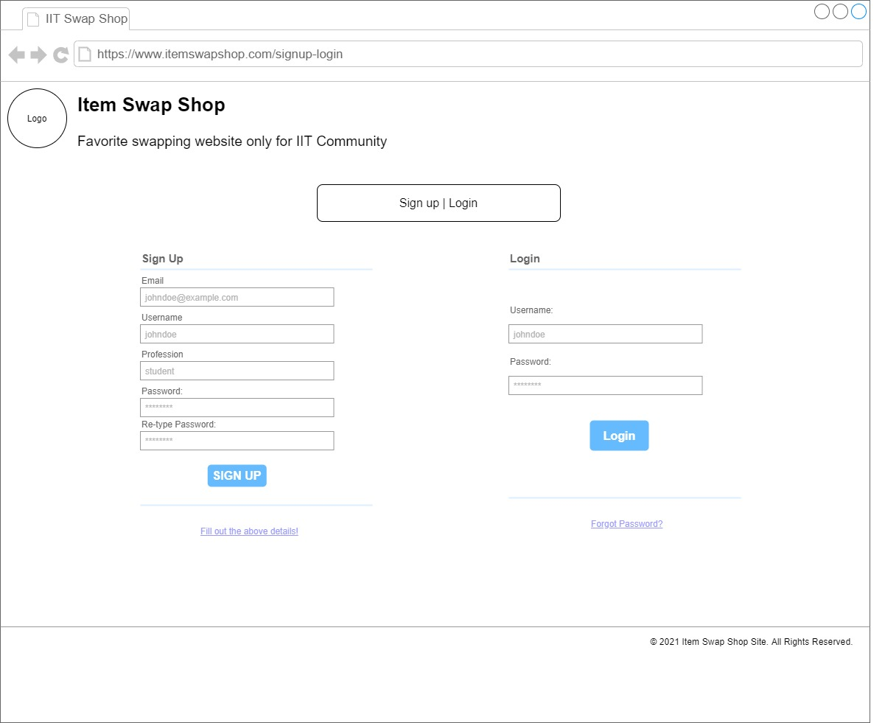
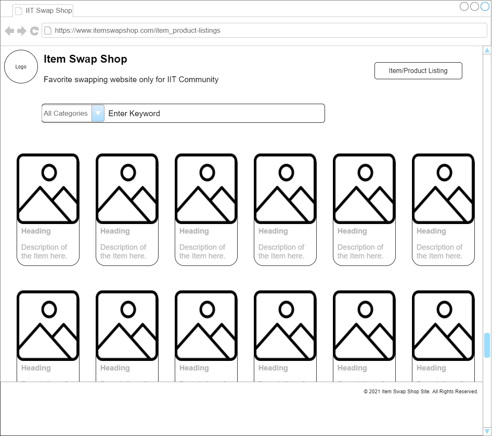

# Sprint-01 Report

## Team Number 06
* **Grace Kwon** - Project Manager
* **Hareem Akram** - Developer
* **Cristian Pintor** - Jr. Developer
* **Rida Tariq** - UI/UX
* **Muhammad Naveed Zahid** - IT Operations

## UI/UX Report
* **Website**
  * Both mobile and desktop friendly
* **Similar websites**
  * https://www.daangn.com/
  * https://www.olx.com.pk/
* **How do similar websites work?**
  * Parallel system for customers running side by side
    * Sellers can upload their advertisements
      * Included: title, description, picture, price
    * Buyers can browse through the listing
      * Browse through several alternatives
      * Contact & negotiate with the seller, then purchase
  * Interesting fact about OLX
    * Conversation, bargaining, advances, and transactions remain between the buyer and seller only
  * C2C (Consumer-to-Consumer) business model

## Developer Report
* **Frontend: HTML, CSS, React.js**
  * HTML & CSS
    * Major players in the overall web design of the final product
  * JavaScript
    * Improves the user experience by taking a static webpage and turning it into a dynamic, interactive one
    * Offers much more in terms of programming beyond aesthetics and ease of use
* **Backend: Python**
  * High efficiency, stability, and scope of development
  * Great readability: blocks of code can be “inherited” (reused) throughout the program – both reducing clutter and the chances of error
    * Inheritance + Python’s relatively simple syntax => faster development
* **Web Framework: Django**
  * Extensive libraries and functions that well-equip Python
  * Used at Instagram and Spotify
    * Instagram: primarily for photo management
    * Spotify: overall backend development & data analytics
  * Integrate well with our website's frontend technology
  * Fully capable of being used in the backend development of a website
    * Any features not present in the backend can be added in the frontend and still work seamlessly
  * Extensive frameworks that improve the development experience
    * <b>Our choice: React.js</b>
      * Renders web pages quickly; elements and content are being loaded without a large delay
        * Improves user experience
        * Allows constant update of any dynamic elements that may be present on the website
      * Created by Facebook
        * Now used by Reddit, Notion.so and even Netflix
  
## IT Infrastructure Report
* **OS: Ubuntu**
  * Compatible with database like MYSQL
  * Open source OS; we can use it with other services as well
* **Database: MySQL**
  * Usage
    * Store customer information and log in information
    * Save data that customers upload
* **Caching layer: X**
  * There won't be a lot of traffic, so it's not needed.
* **Additional features: Chat**
  * Users can communicate with each other.

## Developer and Security Assumptions
* **Security Vulnerabilities**
  * Cross site scripting (XSS): XSS is a vulnerability that allows malicious injections through client-side scripts into a webpage to access data
  * SQL injections: SQL injections that target vulnerabilities in databases in order to gain access, modify, or create new user permissions, or manipulate or destroy data
  * Denial-of-Service (DoS) attacks: attackers overload a server or its surrounding infrastructure with different types of attack traffic to the point where the website becomes sluggish and denies new service requests from real users
  * Data breach
* **Protecting Our Web Application and Data**
  * HTTPS & Encryption
    * With HTTPS, data is transferred between a web browser and website
    * HTTPS encrypts data using the Transport Layer Security (TLS) protocol
    * Encryption occurs through the asymmetric public key infrastructure which uses a private and public key to encrypt and decrypt data
  * How does this apply to our website?
    * Use HTTPS to protect the transfer of data in our web application
      * Prevents website information from being viewed by attackers
      * Encrypts data traffic; any text package is illegible with random characters
    * Self-signed SSL certificate instead of TLS/SSL certificates
      * Implements encryption
      * Useful for projects not in production
      * Open SSL
* **Authentication**
  * Process that allows users to verify their identity to gain access to their accounts
  * Recommendations
    * Encourage users to create strong passwords
    * Multi-factor authentication - requires a user to input a one-time access code sent via email or text
    * Limit password attempts and rests by locking a user out of their account after a certain amount of failed login attempts
      * Prevents any brute force attempts at hacking an account
* **Web Application Firewall (WAF)**
  * Protects a web app against malicious HTTP and HTTPS traffic
  * Protects against vulnerabilities such as cross-site forgery, file inclusion, cross-site scripting, and SQL injection attacks
  * Open source WAF
    * ex) ModSecurity
  * Disadvantages
    * Only detects known vulnerabilities
    * Not able to fix them
      * Instead, it hides the vulnerabilities from the hacker by blocking the malicious requests
* **Web Vulnerability Scanner**
  * Scans websites to identify vulnerabilities and any security issues
    * Cross-site scripting, SQL injections, command injections, etc.
* **When to begin working on security?**
  * Make sure that in every phase of our application development our security goals are met
  * The earlier, the better
  
## User/Admin/Anonymous Story Goes here
### Website Map

### UI/UX Prototypes
#### 1. Home

* Logo & website name on the top
* Brief introduction about the website
* Ability to navigate to other pages
* Ability to search for items
* Copyrights on the bottom

#### 2. About Us

* Our mission
* Team members

#### 3. Login / Sign Up

* Sign Up
  * Basic info
  * Username & Password
* Login
  * Username & Password

#### 4. Customer Account

* Ability to view personal information
* Ability to change

#### 5. Sell Now

* Product info
  * Title, description, (#tag), category, brand, condition, (color), price
  * Picture

#### 6. Custom Product Request

* Personal info
  * Name, email, message
* Item description
  * Product type, date needed, (color, price range)

#### 7. Item Product Listings

* Shows all the items on the website
  * Image, title, and description
* Ability to choose category
* Ability to find item by searching

#### 8. Item Product Info

* Displays what was written on the "sell now" page
* Ability to view seller
  * Able to ask seller questions with chat or comments
  * Able to make offer
* Able to save and share

## Project Manager Report
### Goals for Sprint 1
#### _Week 1 (02/04 ~ 02/10): Research and decide project idea_
  * Research the 7 given options & other ideas
  * Decide project idea and requirements
  * Get everything set up (Slack, Trello, Github, etc.)
#### _Week 2 (02/11 ~ 02/17): Research project specific needs_
  * Developer: Research frontend & backend languages and web frameworks
  * Jr. Developer: Research connection (https etc.), login authentication, and data encryption
  * IT Operations: OS, database, caching later, chats & comments
  * UI/UX: Website map, prototype
  * Project Manager: Assist chat, updates, etc.
#### _Week 3 (02/18 ~ 02/25): Further research on project needs & Deliverables_
  * Further research
  * Deliverables

***All of these goals were accomplished in a timely manner.***

### Goals for Sprint 2
1. Set up Ubuntu
2. Start making the website - backend & frontend
3. Set up database
4. Start implementing security
5. Minor bug fixes

### References
* https://searchsecurity.techtarget.com/tip/How-to-encrypt-and-secure-a-website-using-HTTPS
* https://support.google.com/domains/answer/7630973?hl=en
* https://www.creativebloq.com/web-design/website-security-tips-protect-your-site-7122853
* https://www.hostgator.com/blog/3-easy-steps-that-protect-your-website-from-hackers/
* https://swoopnow.com/website-authentication/
* https://stackoverflow.com/questions/549/the-definitive-guide-to-form-based-website-authentication
* https://beaglesecurity.com/blog/article/how-to-store-and-secure-sensitive-data-in-web-applications.html
* https://www.cloudflare.com/learning/security/what-is-web-application-security/
