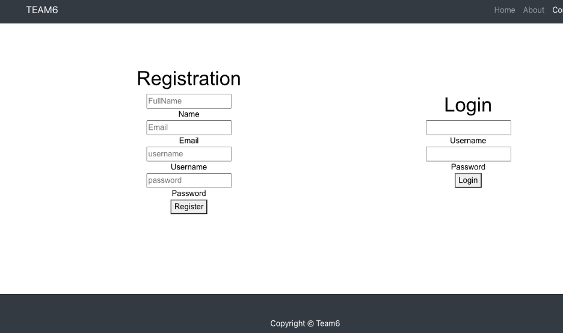
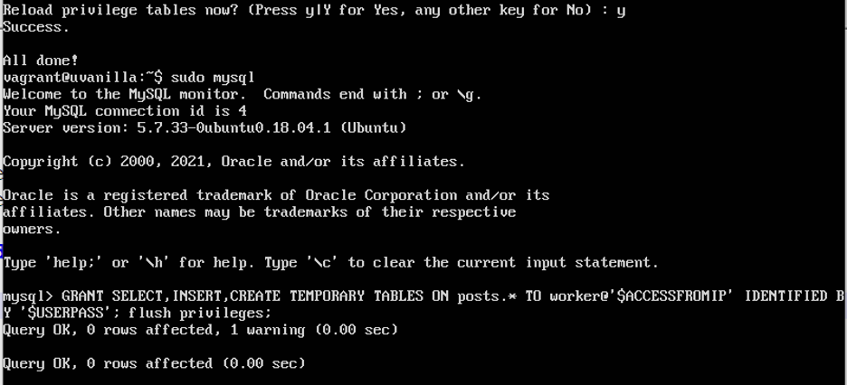
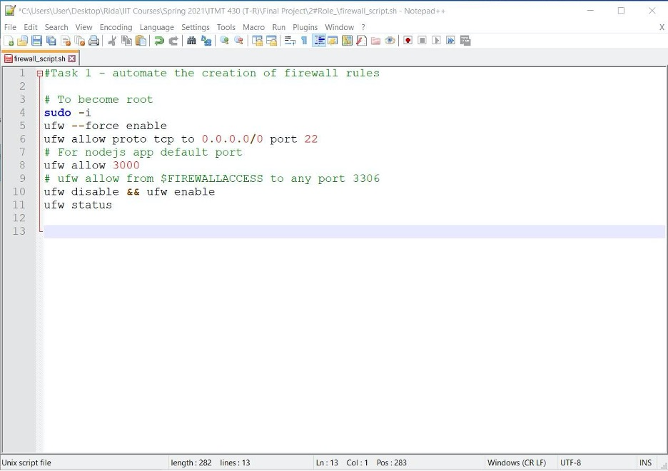
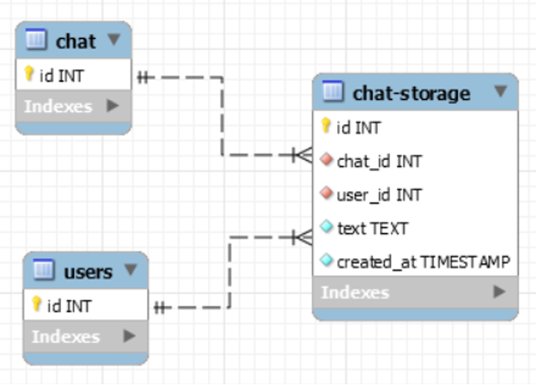
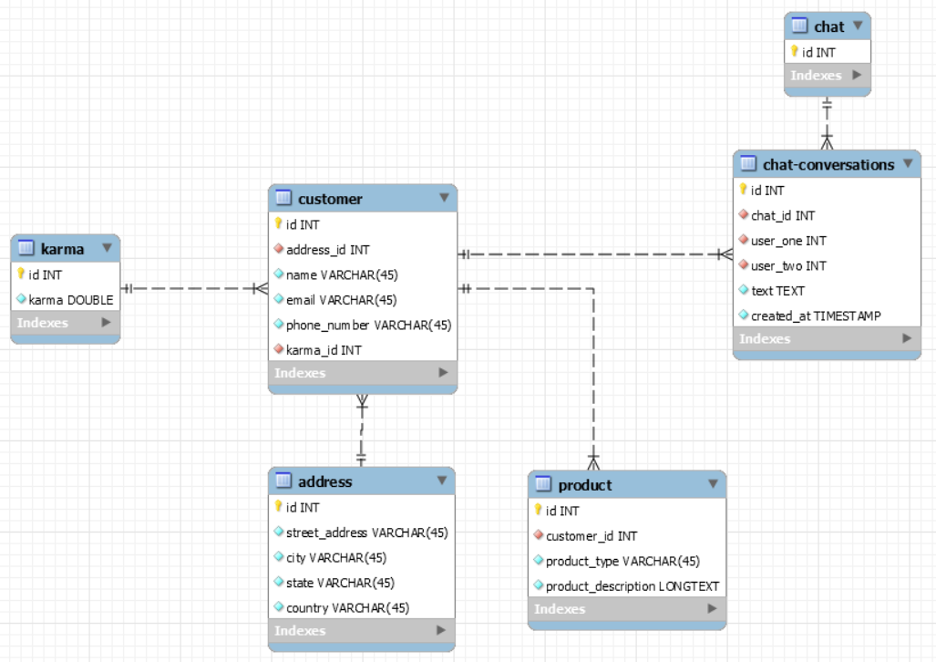

# Sprint-02

## Team Members and Roles

* **Cristian Pintor** - Project Manager
* **Muhammad Naveed Zahid** - Developer
* **Rida Tariq** - Jr. Developer
* **Grace Kwon** - UI/UX
* **Hareem Akram** - IT Operations

## IT Operations

* The IT operations manager was in charge of building and deploying a virtual machine for the entire team, on which we are to host our web application. This virtual machine is completely automated once all variables unique to our machine and web app are filled out and passed into the shell script.

* The virtual machine uses Ubuntu 18.04.5, and has a firewall and database set up. 
* Both the firewall and database are automatically built with the machine, and are customized to fit our needs

All the code and build scripts used to create and deploy this VM were committed and pushed regularly to the team repository with some notable exceptions – namely the .box file, the actual variables used in the creation of the VM, and the RSA key generated to secure the system. These three files remain local with the help of a .gitignore file. Our virtual machine can be accessed at `192.168.33.33:3000` after running a `vagrant up` command to get it running.

## Developer Report

As a developer I had to create pages for the site based on the skeletons that were createdin sprint 1. We were able to achieve that by using the template that was provided in the virtual machine and then modified the templet to our project needs. The reason behind that is we found some templates but when we replaced the code, the machine provided an error and that has been the case for our team this sprint. We were able to create the front end page by using the original template that came with our VM and customized it as we wanted to create the front end.

The IT Operation manager did have some issues setting up the machine as well so we consulted with the Professor and got that up as well then after that I went ahead and created the database by copying the script that was in there already as a sample. As of now, we have a working frontend and the database but we didn’t unfortunately get the backend to work properly. We as a team decided to use Django as our backend and SQL as our database but we were not able to accomplish our backend with it. We followed a lot of instructions we found but when updated to the machine it will error out. I did report it to the project manager and we both tried and same issue and decided to change the language for the back end and more questions were raised so we planned to discuss this in today’s meeting and decide how our team would like to move further.

## Junior Developer Report

### Task 1
Create a non-root/admin user for the database activities following the concept of least privileges. In order to make the system more secure, it is needed to allow the users the only privileges that they need. For example, in an inventory database, the workers do not need to change the inventory states. Otherwise, it can be easily messed up as there may be thousands of workers and any of them can unintentionally change the record. Therefore, the system admin should restrict the root-user privileges to allow the workers to view but not edit/delete the database query. Generally, a user has all the privileges mentioned below.
For example, the following command:

`-- GRANT SELECT,INSERT,UPDATE,DELETE,CREATE,CREATE TEMPORARY TABLES,DROP,INDEX,ALTER ON posts.* TO worker@'$ACCESSFROMIP' IDENTIFIED BY '$USERPASS'; flush privileges;`

creates a user named worker in the server (the ip address of the server is stored in the environment variable '$ACCESSFROMIP') and passes in the password declared in the environment variable ($USERPASS). Moreover, it provides the access to select, insert, update, delete, create, create temporary tables, drop, index, and alter the database. However, such an access is unsafe for the database. Hence, we remove some of the root user rights, for example, create, insert, delete, drop update, alter. Thus, we use the following command: 

`GRANT SELECT,INSERT,CREATE TEMPORARY TABLES ON posts.* TO worker@'$ACCESSFROMIP' IDENTIFIED BY '$USERPASS'; flush privileges;`

### Task 2

The task is to automate the creation of firewall rules using UFW command on Ubuntu. The first step in securing the system is configuring a firewall and to do that we start with UFW (Uncomplicated Firewall) that is a user-friendly interface. It provides a simple way to configure a firewall which is a frontend for managing firewall rules in Ubuntu. This command is used through the command line, and aims to make firewall configuration easy (or, uncomplicated).
We achieved the task in the following way. The command ufw –force enable will properly enable any services to start on boot--without manual intervention. Next, we allow the TCP connections to port 22 on all IPv4 addresses. We also allow access to Nodejs default port 3000 to setup connections. Finally, we checked the status by using the ufw status command. Below is the screenshot of the Ubuntu script. 

## UI/UX Report

Since we were not able to launch the login page, the UI/UX manager did more research on the Karma Abuse feature which we plan to implement into our web application for the items which will be sold on the site. This karma rating will allow users to know the ratiing of a product or a seller and how well their products are being reviewed. This way, shoppers can make their own decisions whetehr to trust the seller or not.

The UI/UX manager also did research on MySQL and MySQL Workbench on how our chats will be stored in our databses. 

### Karma Abuse
  * Extra validation
    * Did the customer really buy the product?
  * Comment moderation
    * No comments will appear until the monitoring process is done (reviewed and approved)
    * More time reviewing comments, but will improve user experience
  * Spam bots?
    * Validate user email
      * School email (hawk email)

  [Ways to Prevent Comment Spam](https://developers.google.com/search/docs/advanced/guidelines/prevent-comment-spam)

### My SQL and MySQL Workbench

#### Chat database storage

#### Entire SQL Schema

## Project Manager report

Since we were not able to acomplish the goal for sprint 2 to create a login page with a backend working alongside our databsde, we will continue to work on this for sprint 3 along with the other tasks that that sprint includes. We hope to acomplish both the sprint 2 and sprint 3 goals in order to catch up with the project goals. 

One of the issues we encountered when working on the backend was the unfamiliarity of Djnago since none of us had worked with that framework in the past. The developer did research and found some articles and videos on how to connect our ReactJS frontend a Djnago backend but was not successfull in connecting both frameworks. I then stepped to helper the developer and considered using another framework for our backend, such as Express.js with Node.js, and I was able to succesfully create a small working web app from a video tutorial but I then had some difficulty figuring out how to connect that backend to a datanse for our own project. 

We then had a meeting before the recording of this report in order to figure out what the next steps should be for our project since we did not meet the sprint 2 goal. I brought up changing our backend to using a MERN stack, as the professor suggested, and the developer and junior developer, along with the UI/UX manager will work more closely together in case that the developer continues to have trouble building the backend.

### Goals for Sprint 2
#### Week 4 (02/26 ~ 03/04)
  * Assign sprint 2 roles
  * Developer: develop login and sign-up skeletons
  * Jr. Developer: assist IT Operations with setting up VM
  * UI/UX: research on MySQL Server & Workbench

#### Week 5 (03/05 ~ 03/11)
  * UI/UX: SQL schema for chat storage
  * IT Operations: build machine
  * Jr. Developer: Create non-root/admin user
  * Developer: View changes on the browser after commiting code from ReactJs app
  * UI/UX: Research more about how to store chats on the website to database
  * Developer: Create login page using ReactJs

#### Week 6 (03/12 ~ 03/18)
* UI/UX: Karma database schema
* Everyone: set-up machine on local computer
* UI/UX: karma database research
* UI/UX: karma abuse research
* Project manager: watch previous ReactJS lecture videos
* Project manager: research MERN stack

### Goals for sprint 3
1. Finish setting up backend
2. Create login page
3. Complete user stories
4. Work on firewall automation and databse
5. Review user stories created by developers