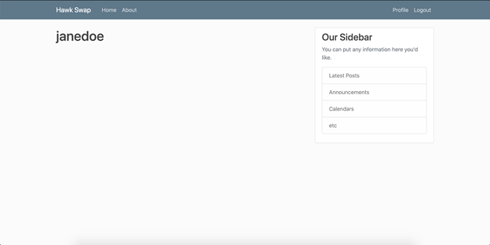
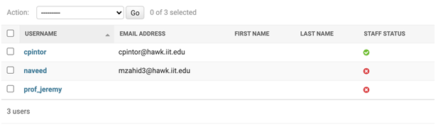
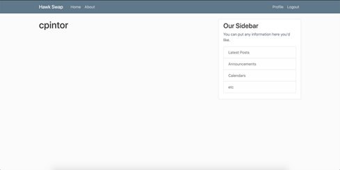
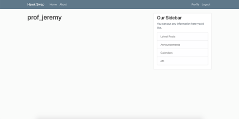
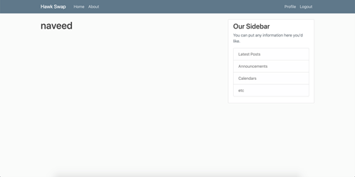
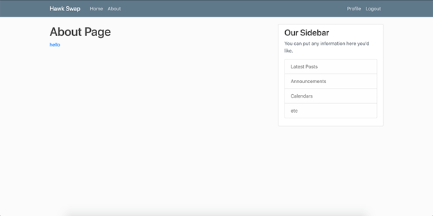

# Sprint-03 Written Report

## Team Number 06
* **Rida Tariq** - Project Manager
* **Cristian Pintor** - Developer
* **Hareem Akram** - Jr. Developer
* **Muhammad Naveed Zahid** - UI/UX
* **Grace Kwon** - IT Operations

### UI/UX Artifacts

In this sprint we did make some changes from and we kind of started from scratch again as the things we decided in the last sprint were not able to work together easily. Definitely I would say that all of our team members went out of their way and helped each other but especially Cristian he did a great job to make sure everything is running smoothly. I was a UI/UX for this sprint and our page will be looking different then we had it in the diagrams as we are using a different language.. It’s just the design that will be different but the stuff is still the same. We have a register page and also the login page. They both are working and connected without any problems. 

The user story as a person who hasn’t seen the site before. When you land on the first page you will have a good color scheme. You have some tabs on the left side like home and about. On the right side we have a login and register button. You can go to the login page and if you don’t have an account you can just click the link below and it will take you to the registration page which is the same if you just register. After you login you are taken to your profile page you can update if needed. From there you can also post and delete a post if needed. This is what we have so far as this sprint required it. Moving forward we are planning on adding the comments section on the post so the user can communicate with each other regarding those posts. 

As mentioned earlier the things the site is doing is similar to the diagrams but the design is different. 

Log In Page:

Register page:

Product listing page: 

User profile:

### Infrastructure

Using Packer and Vagrant you will begin to break your monolithic application up into at least 2 servers (frontend and backend)

*	Using the host only network declared via Vagrant
    * 192.168.33 for frontend

**Vagrantfile for frontend**

**192.168.33.34 for datastore/database**

**Vagrantfile for backend (database)**

*	Store your scripts in a code folder on your repo
*	Update the install.md template file with build and install instructions
  *	This will include automated provisioning of all assumptions and secrets defined in the first sprint (firewall rules, admin accounts, user accounts, secrets/passwords, etc, etc

**You can find detailed installation instructions from this link:**
https://github.com/illinoistech-itm/2021-team06r/blob/main/sprint-03/install.md

*	This will also require automated deployment of the ERD you created for your database and installation of the database product you chose. All of these steps will be automated.

 

**I updated create-table.sql as well as the according files so that the tables shown above are created - customer, address, karma, chat, chat_conversations. Some of them have been populated like this:**

 

 

 

**This matches our previous ERD:**

The one missing table - product - was worked on by Cristian and it looks like this:

 

### Developer

Working user registration page and process

When the user first goes into the site, they will be able to pick between the Login or Register buttons, if the user does not have an account, then the user can create an account through the Registration page. 

User registration page:

After the user has registered, they will see a registration message:

After registration, user can login back in and is first welcomed to the main page:

If the user clicks the Profile link, they can view their profile:

**Working user login (at least 3 accounts demonstrated)**

These are 3 current user accounts:

Here are the profiles for each user listed above:

One of them is an admin user, cpintor, and the rest are front-end users. The admin user can add new users in the backend, delete posts or create new ones. Unfortunately, we did not complete the functionality for front-end users to create posts, but we are currently working on it and should have it working by next sprint!

**Create and identify to us at least 3 additional pages/functionalities**
We currently have an About Page, which should inform the users about our website, we plan to add more pages as well. 

### Junior Developer

For this sprint, the Junior Developer was responsible for two major things: tightening security so only the frontend could connect to the backend, and working with IT Operations and the Developer to create three user accounts that had two posts each in the database.

In order to increase security, the first task that needed to be done was to deny connections to the backend from every IP address but the frontend. We did this by running an uncomplicated firewall (ufw) allow command that would only let the frontend connect to the backend and deny all other connections. In order to further enhance security, the IP address was passed through as a variable, with the actual IP only being found in a variables.json file that remains local and is never pushed to the remote.

To demonstrate that user accounts can be created and used in the application, we hard coded some test accounts into our build scripts with sample data that will populate the appropriate columns when the machine is built and run. Some of these values are dynamic (such as the karma rating of each user), and will be updated as needed once the application is up and running, and in use by those users and more.

### Project Manager

#### User and Admin Story

Working user registration page and process

When the user first goes into the site, they will be able to pick between the Login or Register buttons, if the user does not have an account, then the user can create an account through the Registration page. 

User registration page:

After the user has registered, they will see a registration message:

After registration, user can login back in and is first welcomed to the main page:

If the user clicks the Profile link, they can view their profile:

 The admin user can add new users in the backend, delete posts or create new ones. Unfortunately, we did not complete the functionality for front-end users to create posts, but we are currently working on it and should have it working by next sprint!

#### Goals for Sprint 3
##### _Week 7 (03/19 ~ 03/25):
  * Set up sprint 3 VM with frontend and db
  * Add Django and mariadb setup code got from jhajek repo
  * Get everything set up (Slack, Trello, Github, etc.)
  * Helping developer with setting up VM using Django
  * Setting Up two VMs using install.md file for sprint # 3
##### _Week 8 (03/26 ~ 04/01):
  * Comeup with company name or logo
  * Figuring out Why IT operator cannot connect to localhost even after builds are complete and the machines are up and running?
  * Change database to MySQL
  * Rebuild VM with working Django
  * Add create-table, insert-record using SQL
  * Connect frontend and backend database
##### _Week 9 (04/02 ~ 04/08):
  * Developer: Working user registration page and process. Identify 3 additional functionalities/pages
  * Jr. Developer: Create firewall rules and include the creation of 3 user accounts
  * IT Operations: Update the install.md template file and automated deployment of the ERD created for db
  * UI/UX: Demonstrate and explain how the created artifacts by the Developer match the User Story
  * Project Manager: Assist chat, updates, etc.

***All of the above goals were accomplished in a timely manner.***

##### Tasks Inprogress
* Admin User Story: The task is still incomplete because we lagged behind in Sprint 2. However, this time we completed building the VM for the frontend and backend servers. Our Django server was broken several times since somebody pushed the incomplete work in our Team repository. Unfortunately, we did not complete the functionality for front-end users to create posts, but we are currently working on it and should have it working by next sprint!
* The frontend and backend servers are built but are not cloned by the other teammates. It is because the developer has the codes in the virtual machine but not on his own computer. We are unable to figure it out yet. 

### References
* https://www.youtube.com/watch?v=UmljXZIypDc
* https://www.youtube.com/watch?v=e1IyzVyrLSU
* https://github.com/django/django
* https://github.com/django-dbbackup
* https://docs.djangoproject.com/en/3.1/intro/install/
* https://developer.mozilla.org/en-US/docs/Learn/Server-side/Django/Introduction