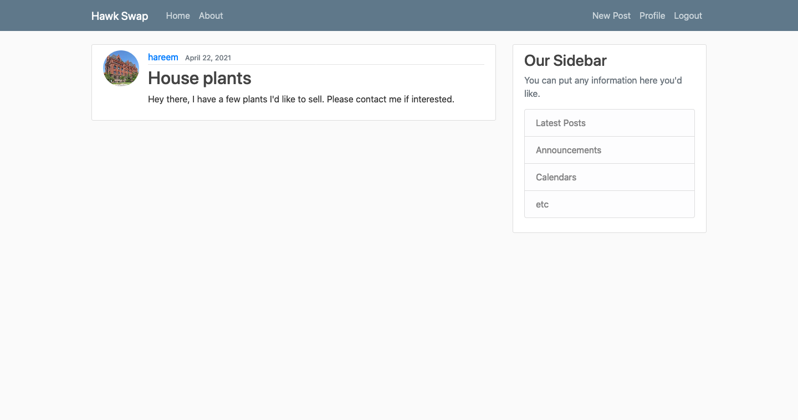

# Sprint-04 Written Report

## Team Number 06

* **Hareem Akram** - Project Manager
* **Grace Kwon** - Developer
* **Muhammad Naveed Zahid** - Jr. Developer
* **Cristian Pintor** - UI/UX
* **Rida Tariq** - IT Operations

## UI/UX Artifacts

The UI/UX role has two major tasks – ensuring that the application is in line with the user stories and artifacts we created in the first sprint (which have since been modified as our team sees fit for our project), and to test the application. In the previous sprint, as we were unable to fully meet the development goals, our UI/UX member focused on user stories, but for this current sprint they were able to not test the developed application, but also assisted worked with the developer and junior developer to make sure our goals were met.

## Infrastructure

We were able to successfully complete the IT Operations and Infrastructure tasks in sprint 3 – our virtual machine was split into frontend and backend servers that would automatically build and deploy with all the variables we've chosen to keep local. Upon building, our Django web application and MySQL databases - as indicated in the ERD we created - are also automatically created and become immediately accessible. Therefore, the team member with this role for sprint 4 in turn assisted the UI/UX member and helped develop user stories that would indicate what our goals were for this current sprint as well as the next one.

## Developer

We fell short on the development front in the last sprint, and were not able to successfully demonstrate the creation of user accounts and posts. This sprint, we rectified that, and users can now sign up on the frontend and use those credentials to log in (previously, only accounts that had been hardcoded were able to log in), and create, edit and delete their own posts. They can also edit their profiles by updating names, emails and adding profile pictures to replace the default Hawk logo.

### Screenshots

**Homepage**

**Sign up and Login pages**

**Creating, editing/deleting and viewing posts**

**User profile**

## Junior Developer

Our junior developer was also able to complete most of their tasks for the previous sprint, with one notable exception being the user posts which are hardcoded into the build. Using the users we had included in our build previously, we were able to insert posts into our MySQL tables and display those on the frontend.

**Here are images showing the backend and frontend for those posts (posts 2, 5 and 6 have been inserted into the backend, as indicated by the time/date values):**

## Project Manager

### Goals for Sprint 4
**Week 10 (4/9 - 4/15)** and **Week 11 (4/16 - 4/22)**
- [x] Go over goals we were unable to meet for sprint 3 and develop plan to achieve those
- [x] Assign new roles to team members and outline expectations for this sprint
- [x] Rebuild VM as per new install.md file to ensure everyone can access the application
- [x] Meet bi-weekly to check progress and reallocate resources as needed
- [x] UI/UX: Develop at least 3 user stories and match user needs with website functionality
- [x] Infrastructure: Act as a guide for team as they rebuild VMs
- [x] Developer: Continue working on application to ensure login and sign up pages function as expected
- [x] Developer: Demonstrate creation of user accounts and user posts
- [x] Jr. Developer: Insert posts into backend to be built and deployed with the VM
- [x] Project Manager: Help wherever, assist with backend SQL tables/insertions, provide resources to team, etc

** *All these goals were met within the Sprint 4 timeframe.* **
